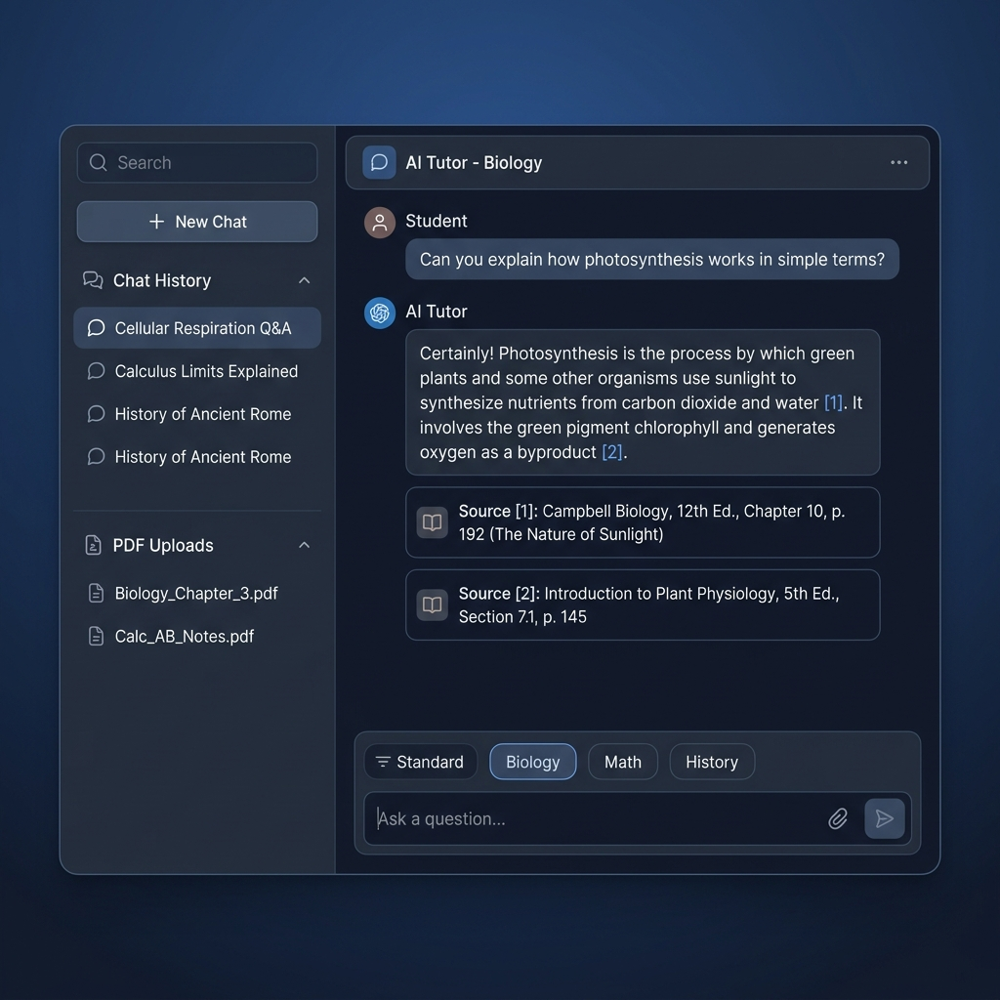
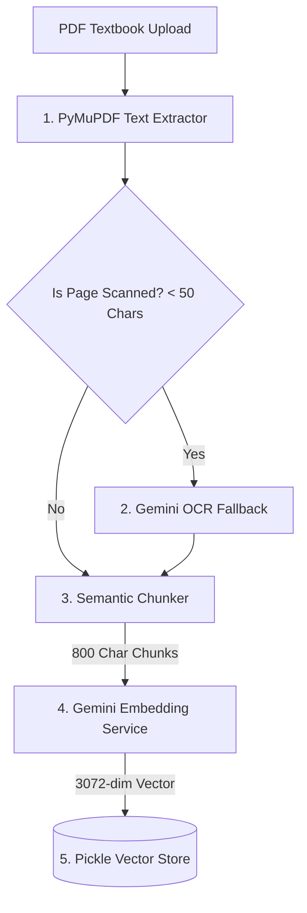
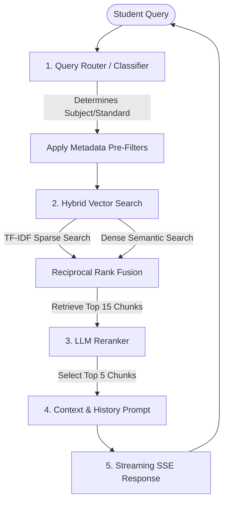

# Conversational RAG School Textbook Chatbot

A conversational AI school textbook assistant designed to help students study smarter. The chatbot answers student questions strictly using the provided textbook knowledge base. It is built with a Retrieval-Augmented Generation (RAG) pipeline on a FastAPI backend and a React + Vite + Tailwind CSS frontend dashboard.

---

## 📸 Product Interface



---

## 🌟 Key Features

*   **Strict RAG Boundary**: Answers are generated strictly from the uploaded textbooks. If the information isn't present, the bot replies: *"I am sorry, but the information to answer this question is unavailable in the provided textbook database."*
*   **Source Citations**: Returns clickable source anchors (e.g. `[1]`, `[2]`) in the chat window citing the exact textbook, standard, subject, and page number.
*   **Custom Hybrid Search**: Combines dense semantic similarity (`gemini-embedding-2`) and sparse keyword matching (TF-IDF) using Reciprocal Rank Fusion (RRF) for fast, compile-free search.
*   **Smart Ingestion & OCR**: Extracts page-by-page text using PyMuPDF. Scanned pages are automatically transcribed in memory using Gemini's multimodal capabilities (no heavy Tesseract installation required).
*   **API Rate-Limit Safe**: Optimally batches text chunks to minimize GenAI API overhead.

---

## 📊 System Architecture

### 1. Ingestion Pipeline (PDF to Vector Store)
This pipeline handles textbook ingestion, OCR fallback for scanned pages, semantic chunking, and embedding generation:



### 2. Retrieval & Generation Pipeline (RAG Chat)
This coordinates query classification, metadata filtering, hybrid search, reranking, and SSE streaming:



---

## 🛠️ Tech Stack

*   **Frontend**: React, Vite, Tailwind CSS, Lucide icons
*   **Backend**: FastAPI, Uvicorn, SQLite (via SQLAlchemy)
*   **AI Services**: Google GenAI SDK (`gemini-3.5-flash` & `gemini-embedding-2`)
*   **Data Processing**: NumPy, Scikit-learn, PyMuPDF (fitz)

---

## 🚀 Quick Start

### 1. Configure Environment
Create a `.env` file in the `backend/` directory:
```env
PROJECT_NAME="Conversational RAG Textbook Board"
API_V1_STR="/api"
DATABASE_URL="sqlite:///./sql_app.db"
SECRET_KEY="your_jwt_secret_key"
ACCESS_TOKEN_EXPIRE_MINUTES=1440
GEMINI_API_KEY="YOUR_GEMINI_API_KEY"
```

### 2. Run the Backend API
```bash
cd backend
pip install -r requirements.txt
uvicorn app.main:app --reload --host 127.0.0.1 --port 8000
```
*API will be active at: `http://127.0.0.1:8000` (Interactive docs: `/docs`)*

### 3. Run the Frontend Dashboard
```bash
cd frontend
npm install
npm run dev
```
*Open `http://localhost:5173` in your browser.*

---

## 🧪 Running Tests
Verify the pipeline works correctly by running the unittests:
```bash
$env:PYTHONPATH="backend"
python -m unittest discover -s tests -p "test_*.py"
```
